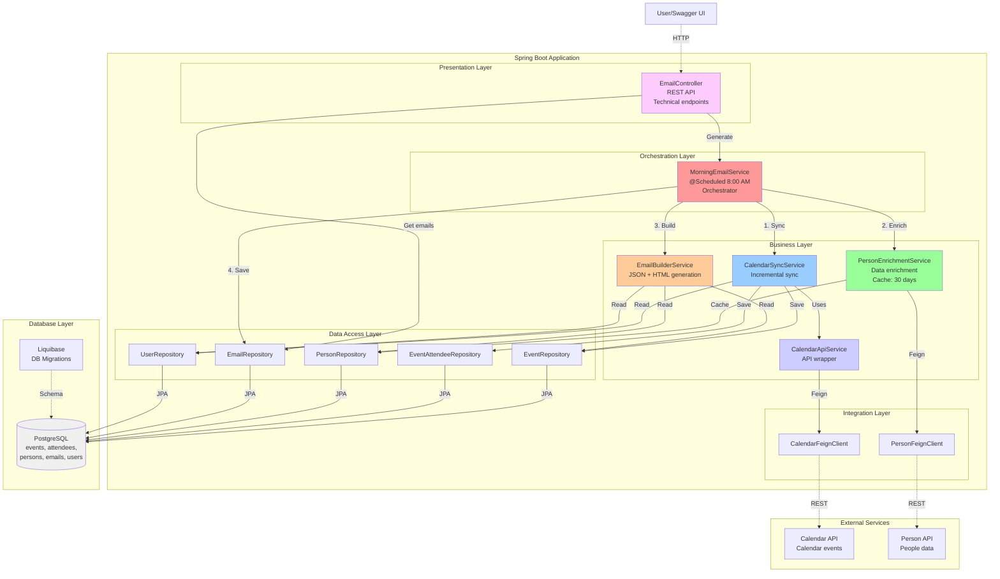

# Calendar Enrichment Service

A service for automatic generation of morning calendar event digests with enriched participant information.

## Quick Start

### 1. Environment Variables Setup (Optional)

The project includes an `.env.example` file with examples of all necessary environment variables.

```bash
# Create a local .env file
cp .env.example .env

# Edit values in .env if needed
```

**Note:** If you don't create a `.env` file, default values from `docker-compose.yaml` will be used.

### 2. Running the Application

```bash
make all
```

This command automatically:

- Checks and installs Java 17+ (if needed)
- Checks and installs Docker (if needed)
- Starts PostgreSQL in Docker (with settings from `.env` if the file exists)
- Builds the project
- Starts the application

After startup, open:

- **Swagger UI**: http://localhost:8080/swagger-ui/index.html
- **API Docs**: http://localhost:8080/v3/api-docs

## Available Commands

All main operations are performed through the Makefile:

```bash
make help          # Show all available commands
make setup         # Start infrastructure only (PostgreSQL)
make build         # Build the project
make test          # Run tests
make test-coverage # Run tests with coverage report (automatically opens in browser)
make run           # Run application locally
make stop          # Stop infrastructure
make clean         # Clean build artifacts and stop containers
```

## Technologies

- Java 17
- Spring Boot 3.5.6
- Spring Cloud
- PostgreSQL
- Liquibase (DB migrations)
- SpringDoc OpenAPI (Swagger)
- Feign Client (external API integration)
- Jackson (JSON serialization)

## Database Configuration

PostgreSQL is used by default:

- **URL**: jdbc:postgresql://localhost:5432/mydatabase
- **User**: myuser
- **Password**: secret

### Changing Database Settings

**Via .env file:**

```bash
cp .env.example .env
# Edit variables in .env
```

Variables from `.env` are automatically used by Docker Compose.

## Architecture



### Layer Description

- **Presentation Layer**: REST API controllers for viewing and testing email generation (Swagger/OpenAPI documented)
- **Orchestration Layer**: Scheduled tasks for automatic email generation
- **Business Layer**: Business logic for synchronization, enrichment, content generation, and API integration
- **Data Access Layer**: Database operations via JPA repositories
- **Integration Layer**: Feign clients for external API integration

### Available API Endpoints

Access via Swagger UI: http://localhost:8080/swagger-ui/index.html

**Email Controller** (`/api/emails`):
- `GET /api/emails/user/{userId}` - Get all emails for a user
- `GET /api/emails/user/{userId}/date/{date}` - Get email for specific date
- `GET /api/emails/user/{userId}/date/{date}/json` - Get email JSON content (scheduler output)
- `GET /api/emails/user/{userId}/date/{date}/html` - Get email HTML preview
- `POST /api/emails/user/{userId}/generate` - Manually trigger email generation (testing)
- `GET /api/emails/latest` - Get 10 latest emails across all users

## Test Environment Limitations

**⚠️ IMPORTANT**: Person API in test environment **DOES NOT return data for any email**.

### Testing Solution

A ready-to-use SQL script with test data is provided for testing enrichment functionality:

**Use the ready script via command line:**

First, ensure the PostgreSQL container is running:

```bash
make setup
```

Then load the test data:

```bash
docker exec -i calendar-enrichment-service-postgres psql -U myuser -d mydatabase < test-data.sql
```

**The script adds test data for:**

- 3 participants from Algolia (john@algolia.com, jane@algolia.com, bob@algolia.com)
- 2 participants from UserGems (christian@usergems.com, stephan@usergems.com)
- 2 external contacts (sarah@techcorp.com, mike@startup.io)

**Script file:** `test-data.sql` (in project root)

## Project Structure

```
src/main/java/rs/usergems/calendar/enrichment/
├── controller/               # REST API controllers
│   └── EmailController.java
├── client/                   # Feign clients for external APIs
│   ├── CalendarFeignClient.java
│   └── PersonFeignClient.java
├── config/                   # Spring configuration
│   ├── CalendarApiProperties.java
│   ├── PersonApiProperties.java
│   └── FeignConfiguration.java
├── dto/                      # Data Transfer Objects
│   ├── AttendeeDto.java
│   ├── CalendarApiResponse.java
│   ├── CalendarEventDto.java
│   ├── ColleagueMeetingCount.java
│   ├── CompanyDto.java
│   ├── EmailContentJson.java
│   ├── MeetingDto.java
│   ├── MeetingHistory.java
│   └── PersonDto.java
├── entity/                   # JPA entities
│   ├── EmailEntity.java
│   ├── EventAttendeeEntity.java
│   ├── EventEntity.java
│   ├── PersonEntity.java
│   └── UserEntity.java
├── repository/               # Spring Data JPA repositories
│   ├── EmailRepository.java
│   ├── EventAttendeeRepository.java
│   ├── EventRepository.java
│   ├── PersonRepository.java
│   └── UserRepository.java
└── service/                  # Business logic
    ├── CalendarApiService.java
    ├── CalendarSyncService.java
    ├── EmailBuilderService.java
    ├── MorningEmailService.java
    └── PersonEnrichmentService.java
```

## Testing

### Running Tests

```bash
# Run all tests
make test

# Run tests with coverage report
make test-coverage
```

The `make test-coverage` command:

- Runs all tests
- Generates coverage report
- Automatically opens HTML report in browser

### Code Coverage Measurement (JaCoCo)

**Current coverage: 53%**

The project uses JaCoCo for code coverage measurement.

The `make test-coverage` command:

- Runs all tests
- Generates coverage report
- Automatically opens HTML report in browser

JaCoCo report shows:

- Overall code coverage percentage
- Coverage by packages, classes, and methods
- Uncovered lines of code (highlighted in red)

Minimum coverage threshold is set to 50% (configurable in `pom.xml`).

## Monitoring

Available Actuator endpoints:

- **Health Check**: http://localhost:8080/actuator/health
- **Metrics**: http://localhost:8080/actuator/metrics
- **Prometheus**: http://localhost:8080/actuator/prometheus
